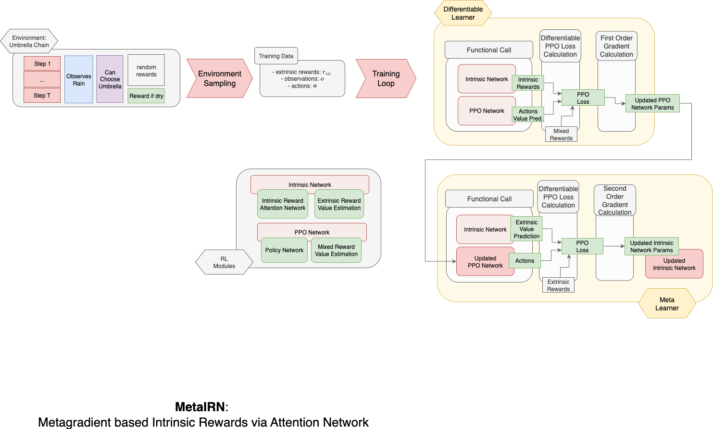

# 🏗️ Architecture & Algorithm

  
  
  

---

## 📜 Overview

This section provides a description of our **Intrinsic Attention PPO**
architecture and implementation, built on top of [RLLib](https://docs.ray.io/en/latest/rllib/index.html). The approach
is designed for **meta-gradient reinforcement learning** and extends
the [standard PPO algorithm](https://docs.ray.io/en/latest/rllib/rllib-algorithms.html#ppo) with an intrinsic
self-attention mechanism.

  

Our implementation is structured into **three main subcategories**:

1. **Algorithm** – Orchestrates environment sampling and the training procedure.
2. **RL Modules** – Contains the PyTorch-based neural network architectures.
3. **Learners** – Implements loss functions, gradient calculation, and parameter updates.

---

## ⚙️ Algorithm

**Main File:** [`algorithm/IntrinsicAttentionPPO.py`](algorithm/IntrinsicAttentionPPO.py)  
This extends the **PPO algorithm** from RLLib with custom sampling, batch creation, and the meta-gradient learning
pipeline.

- **Training Step:** Handles the main RL loop.
- **Sampling:** Collects trajectories from the environment.
- **Batch Creation:** Prepares data for both inner and outer loop learners.
- **Learning Pipeline:** Initiates both PPO updates and meta-gradient updates.

**Configuration:**

- [`algorithm/IntrinsicAttentionPPOConfig.py`](algorithm/IntrinsicAttentionPPOConfig.py) – Base configuration.
- [`algorithm/IntrinsicAttentionPPOHydraConfig.py`](algorithm/IntrinsicAttentionPPOHydraConfig.py) – Hydra-adapted
  configuration for seamless experiment management.

🔗 **Reference:** [RLLib PPO Documentation](https://docs.ray.io/en/latest/rllib/rllib-algorithms.html#ppo)

---

## 🧠 RL Modules

### [`rl_modules/DifferentiablePPOModule.py`](rl_modules/DifferentiablePPOModule.py)

A differentiable PPO policy/value network:

- **Observation Embedding:** Embeds inputs via a configurable MLP.
- **Policy Head:** Outputs action logits.
- **Value Head:** Predicts state values for **extrinsic + intrinsic reward**.
- Fully compatible with PyTorch autograd for meta-gradient backpropagation.

### [`rl_modules/IntrinsicAttentionModule.py`](rl_modules/IntrinsicAttentionModule.py)

Outer-loop module with a **configurable self-attention network**:

- **Flexible Attention Architecture:** Variable heads, layers, and optional embedding/output MLPs.
- **Separate Extrinsic Value Head:** Required because the PPO module predicts only combined reward values.
- Updated exclusively in the **meta-gradient step**.

**Shared Config:** [`config.py`](config.py) – Holds reusable parameters.

---

## 📚 Learners

The **Learners** implement the most critical and complex logic. By default, RLLib’s PPO calculates **Advantages** and
**Value Targets** using **non-differentiable** NumPy-based operations. For meta-gradient learning, these operations must
be differentiable. We therefore rewrote the complete GeneralAdvantageEstimation in a differentiable pytorch way.

### Differentiable Advantage Estimation

- Implemented in [
  `learners/learner_utils/pytorch_differentiable_funcs.py`](learners/learner_utils/pytorch_differentiable_funcs.py).
- Replaces RLLib’s default **Generalized Advantage Estimation (GAE)** with a fully differentiable PyTorch
  implementation.
- Extensive testing for this module can be found in top level [tests](../../tests)

### Removing Default GAE Connector

- [
  `learners/learner_utils/remove_gae_from_learner_connector.py`](learners/learner_utils/remove_gae_from_learner_connector.py)
  removes the non-differentiable GAE from RLLib’s learner connector chain.

### Custom PPO Loss

- [`CustomPPOLearner.py`](learners/CustomPPOLearner.py) overrides PPO loss computation to integrate differentiable GAE.

### Meta-Gradient Learners

- **Outer Loop** **`IntrinsicAttentionMetaLearner.py`**  
  Manages the **outer loop**, performing the meta-gradient update on the intrinsic reward network.

- **Inner Loop** **`IntrinsicAttentionPPOLearner.py`**  
  Implements the **inner loop**, updating the Proximal Policy Optimization (PPO) network, including both the value head
  and the policy head.  
  This learner inherits from **RLlib’s `DifferentiableLearner`** to ensure full differentiability for meta-gradient
  computation, enabling gradient calculation through `torch.autograd` and allowing backpropagation through the policy
  optimization process.

#### Outer and Inner Loop Meta-Gradient Handling

The meta-gradient optimization process is divided between two specialized learner classes, each responsible for a
distinct loop within the meta-learning framework.

The **meta-gradient learner** computes **second-order meta-gradients**, also leveraging `torch.autograd`, and
applies the updates by:

1. Setting gradients directly in the relevant module parameters.
2. Invoking the corresponding optimizers.

While the learner inherits from **RLlib’s `TorchMetaLearner`** —which provides the general structural framework for
meta-learning, many methods were overridden. This was necessary
because RLlib’s default implementation is designed to compute meta-gradients for
*all* modules, whereas the present approach restricts computation exclusively to the parameters of the **intrinsic
reward network**.

---

## 📖 References & Resources

- [RLLib Official Documentation](https://docs.ray.io/en/latest/rllib/index.html)
- [PPO Algorithm – Schulman et al. (2017)](https://arxiv.org/abs/1707.06347)
- [Generalized Advantage Estimation – Schulman et al. (2015)](https://arxiv.org/abs/1506.02438)
- [Meta-Gradient Reinforcement Learning – Xu et al. (2018)](https://arxiv.org/abs/1805.09801)
- [Hydra – Configuration Framework](https://hydra.cc/)

---

